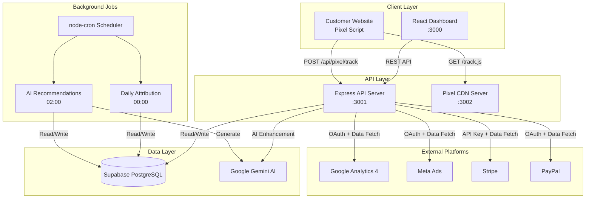
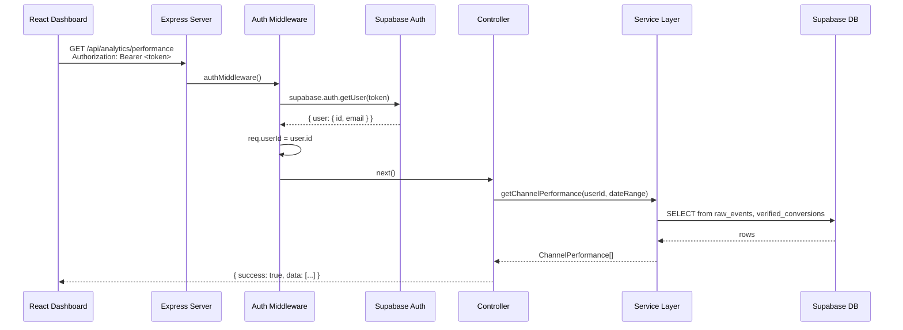
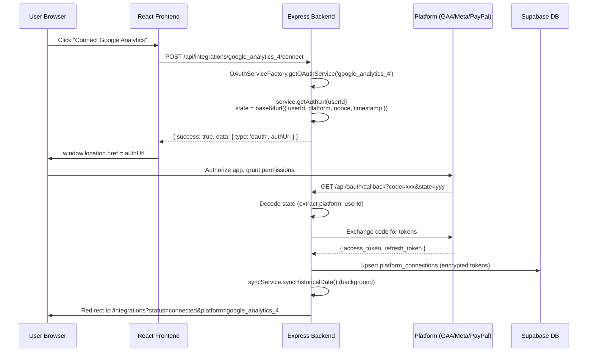
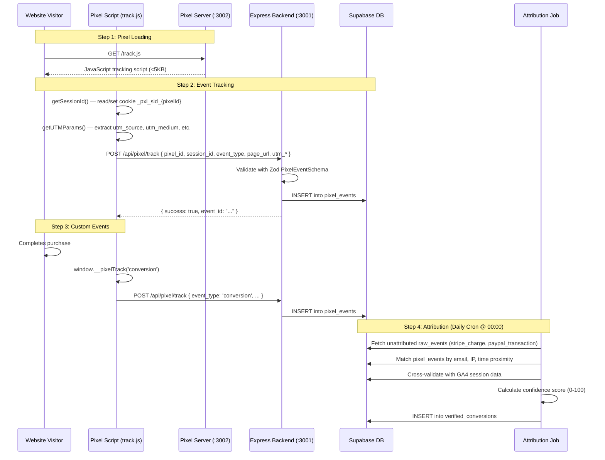
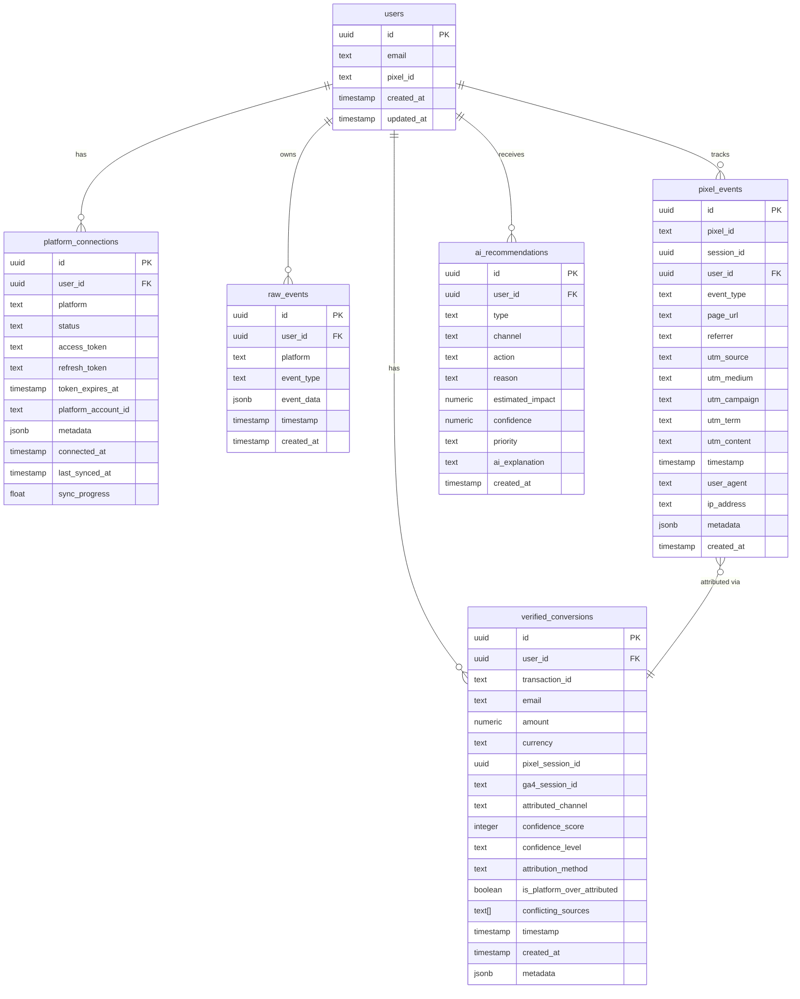
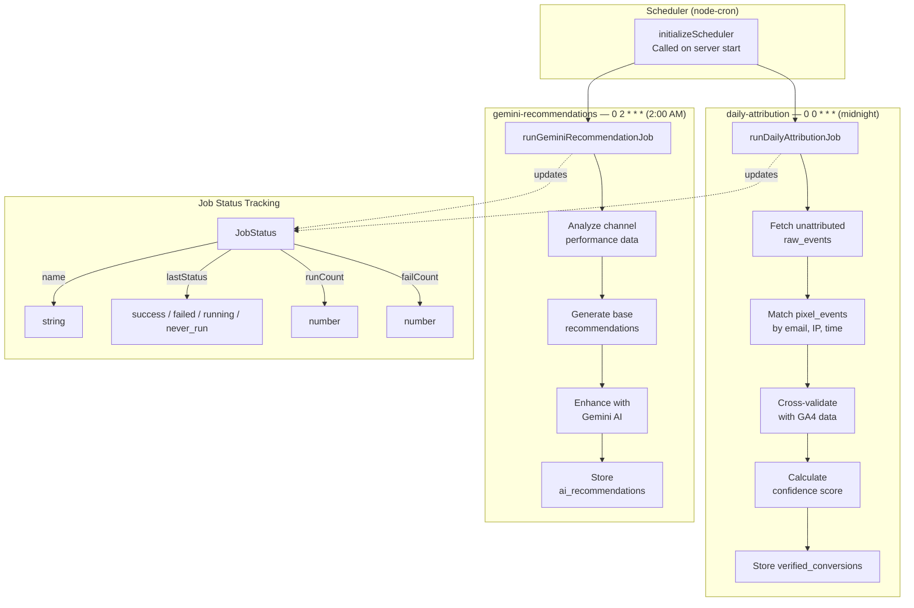

# System Architecture

Technical architecture of the Marketing Intelligence Platform — a monorepo with four packages that work together to collect, attribute, and analyze marketing performance data.

## System Overview

## Request Flow

How an authenticated API request is processed from the React frontend to the backend.

## OAuth Connection Flow

How a user connects a marketing platform (e.g., Google Analytics 4) via OAuth.

## Pixel Tracking & Attribution Flow

How the tracking pixel captures user activity and how conversions are attributed.

## Database Entity Relationship Diagram

## Background Job Architecture

All jobs run in the **Asia/Manila** timezone. Jobs can be manually triggered via the scheduler's `triggerJob(name)` function.

## Related Documentation

- [API Specification (OpenAPI)](../api/openapi.yaml) — Full endpoint reference
- [Attribution Engine](../../documentation/ATTRIBUTION_ENGINE.md) — Detailed attribution logic
- [Gemini AI Integration](../../documentation/GEMINI_AI.md) — AI recommendation pipeline
- [OAuth Integration Guide](../../documentation/OAuth-Integration-Guide.md) — OAuth flow implementation details
